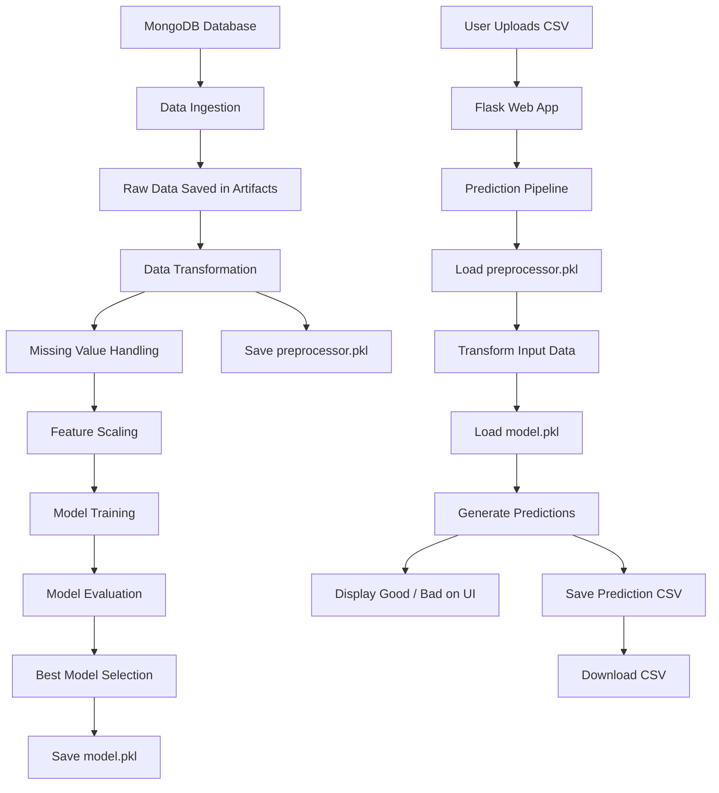

# 🚀 Sensor Fault Detection using Machine Learning

<p align="center">
  
</p>

<p align="center">
  <b>An end-to-end Machine Learning web application that predicts whether wafer sensor records are Good or Bad using a modular ML pipeline, Flask, MongoDB, and Scikit-Learn.</b>
</p>

<p align="center">
  
  
  
  
  
  
</p>

---

## 📌 Project Overview

In semiconductor manufacturing, wafer sensors generate large volumes of readings during production. Faulty readings can indicate defects in the wafer manufacturing process, which may lead to quality issues, production losses, and increased inspection cost.

This project solves that problem by building an **End-to-End Sensor Fault Detection System** that predicts whether each wafer sensor record is:

* **Good**
* **Bad**

The application provides a simple Flask-based web interface where a user can upload a CSV file, view predictions directly on the page, and download the final prediction output as a CSV file.

---

## 🎯 Project Objective

The main objective of this project is to build a production-style Machine Learning system that can:

* Collect wafer sensor data from MongoDB
* Preprocess and transform raw sensor readings
* Train multiple ML classification models
* Select the best-performing model
* Save the trained model and preprocessor
* Accept new CSV files for prediction
* Display prediction results on the web page
* Allow users to download prediction output

This project is not just a model training notebook. It is structured like a real-world ML application with separate components for ingestion, transformation, training, prediction, logging, and exception handling.

---

## 📸 Application Screenshots

> Add these screenshots inside an `images/` folder in your repository.

### Upload CSV Page

<p align="center">
  
</p>

---

### Prediction Result Page

<p align="center">
  
</p>

---


## ✨ Features

* Upload wafer sensor CSV files through Flask UI
* Predict wafer sensor quality as `good` or `bad`
* Display prediction result on the same web page
* Show sensor-wise prediction output
* Download prediction output as CSV
* Train model using `/train` route
* Modular ML pipeline architecture
* MongoDB-based data ingestion
* Data preprocessing using Scikit-Learn pipelines
* Missing value handling
* Feature scaling using RobustScaler
* Multiple model training
* Hyperparameter tuning using GridSearchCV
* Model serialization using Pickle / Dill
* Custom logging
* Custom exception handling
* YAML-based model configuration

---

## 🧠 Tech Stack

| Category             | Technology            |
| -------------------- | --------------------- |
| Programming Language | Python                |
| Backend Framework    | Flask                 |
| Machine Learning     | Scikit-Learn, XGBoost |
| Database             | MongoDB               |
| Data Processing      | Pandas, NumPy         |
| Model Tuning         | GridSearchCV          |
| Model Serialization  | Pickle, Dill          |
| Frontend             | HTML, CSS, Jinja2     |
| Configuration        | YAML                  |
| Logging              | Python Logging        |
| Version Control      | Git, GitHub           |

---

## 🏗 System Architecture



---

## 🔄 End-to-End Workflow

### Training Pipeline

```text
/train route
   ↓
TrainingPipeline
   ↓
DataIngestion
   ↓
Fetch data from MongoDB
   ↓
Save raw data into artifacts/
   ↓
DataTransformation
   ↓
Handle missing values and scale features
   ↓
Save preprocessor.pkl
   ↓
ModelTrainer
   ↓
Train multiple ML models
   ↓
Select best model
   ↓
Tune hyperparameters using GridSearchCV
   ↓
Save model.pkl
```

### Prediction Pipeline

```text
/predict route
   ↓
User uploads CSV file
   ↓
PredictionPipeline
   ↓
Save uploaded file into prediction_artifact/
   ↓
Load saved preprocessor
   ↓
Transform uploaded data
   ↓
Load trained model
   ↓
Generate prediction
   ↓
Map prediction:
       0 → bad
       1 → good
   ↓
Save prediction/prediction_file.csv
   ↓
Show result on UI
   ↓
Download prediction CSV
```

---

## 📁 Project Structure

```text
sensor_fault_detection/
│
├── app.py
├── requirements.txt
├── setup.py
├── upload_data.py
├── README.md
│
├── artifacts/
│   ├── model.pkl
│   ├── preprocessor.pkl
│   └── wafer_fault.csv
│
├── config/
│   └── model.yaml
│
├── notebooks/
│   └── wafer_23012020_041211.csv
│
├── prediction/
│   └── prediction_file.csv
│
├── prediction_artifact/
│   └── uploaded_prediction_file.csv
│
├── src/
│   ├── __init__.py
│   ├── exception.py
│   ├── logger.py
│   │
│   ├── constant/
│   │   └── __init__.py
│   │
│   ├── components/
│   │   ├── data_ingestion.py
│   │   ├── data_transformation.py
│   │   └── model_trainer.py
│   │
│   ├── pipeline/
│   │   ├── train_pipeline.py
│   │   └── predict_pipeline.py
│   │
│   └── utils/
│       └── main_utils.py
│
├── static/
│   └── css/
│       └── style.css
│
└── templates/
    └── upload_file.html
```


---

## ⚙️ Installation and Setup

### 1. Clone Repository

```bash
git clone https://github.com/<your-username>/sensor_fault_detection.git
cd sensor_fault_detection
```

### 2. Create Virtual Environment

```bash
python -m venv venv
```

### 3. Activate Virtual Environment

For Windows:

```bash
venv\Scripts\activate
```

For macOS/Linux:

```bash
source venv/bin/activate
```

### 4. Install Dependencies

```bash
pip install -r requirements.txt
```

---

## 🔐 Environment Variables

If your MongoDB credentials are currently inside the code, move them to `.env`.

Create a `.env` file:

```env
MONGO_DB_URL=your_mongodb_connection_string
```

Then load it in Python:

```python
from dotenv import load_dotenv
import os

load_dotenv()

MONGO_DB_URL = os.getenv("MONGO_DB_URL")
```

Also add `.env` to `.gitignore`.

```text
.env
venv/
__pycache__/
artifacts/
prediction/
prediction_artifact/
logs/
```

---

## ▶️ Run the Application

```bash
python app.py
```

The Flask app will run at:

```text
http://127.0.0.1:5000
```

---

## 🏋️ Train the Model

Open this URL in your browser:

```text
http://127.0.0.1:5000/train
```

## 🔮 Make Predictions

Open:

```text
http://127.0.0.1:5000/predict
```
---

## 👨‍💻 Author

**Anand Bhagat**

B.Tech CSE (AI & ML)
Python Backend & Machine Learning Developer

---

## ⭐ Final Note

This project demonstrates how machine learning can be integrated with backend development to build a complete real-world application. It combines data engineering, model training, software architecture, and web deployment concepts into one modular project.
