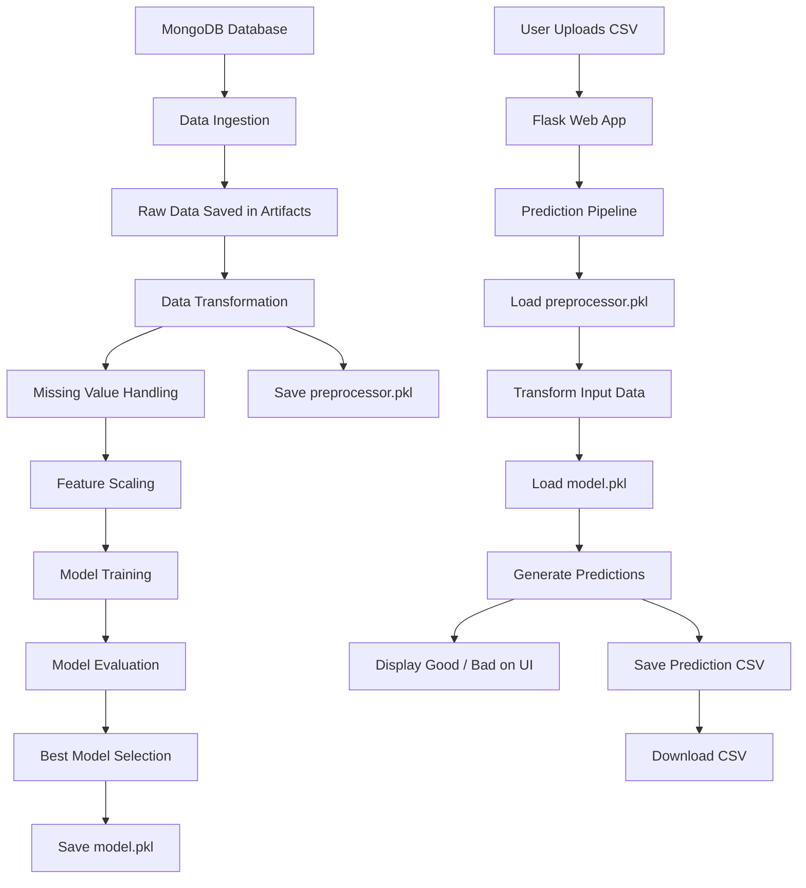

# 🚀 Sensor Fault Detection using Machine Learning

<p align="center">
  
</p>

<p align="center">
  <b>An end-to-end Machine Learning web application that predicts whether wafer sensor records are Good or Bad using a modular ML pipeline, Flask, MongoDB, and Scikit-Learn.</b>
</p>

<p align="center">
  
  
  
  
  
  
</p>

---

## 📌 Project Overview

In semiconductor manufacturing, wafer sensors generate large volumes of readings during production. Faulty readings can indicate defects in the wafer manufacturing process, which may lead to quality issues, production losses, and increased inspection cost.

This project solves that problem by building an **End-to-End Sensor Fault Detection System** that predicts whether each wafer sensor record is:

* **Good**
* **Bad**

The application provides a simple Flask-based web interface where a user can upload a CSV file, view predictions directly on the page, and download the final prediction output as a CSV file.

---

## 🎯 Project Objective

The main objective of this project is to build a production-style Machine Learning system that can:

* Collect wafer sensor data from MongoDB
* Preprocess and transform raw sensor readings
* Train multiple ML classification models
* Select the best-performing model
* Save the trained model and preprocessor
* Accept new CSV files for prediction
* Display prediction results on the web page
* Allow users to download prediction output

This project is not just a model training notebook. It is structured like a real-world ML application with separate components for ingestion, transformation, training, prediction, logging, and exception handling.

---

## 📸 Application Screenshots

> Add these screenshots inside an `images/` folder in your repository.

### Upload CSV Page

<p align="center">
  
</p>

---

### Prediction Result Page

<p align="center">
  
</p>

---

### Downloaded Prediction CSV

<p align="center">
  
</p>

---

## ✨ Features

* Upload wafer sensor CSV files through Flask UI
* Predict wafer sensor quality as `good` or `bad`
* Display prediction result on the same web page
* Show sensor-wise prediction output
* Download prediction output as CSV
* Train model using `/train` route
* Modular ML pipeline architecture
* MongoDB-based data ingestion
* Data preprocessing using Scikit-Learn pipelines
* Missing value handling
* Feature scaling using RobustScaler
* Multiple model training
* Hyperparameter tuning using GridSearchCV
* Model serialization using Pickle / Dill
* Custom logging
* Custom exception handling
* YAML-based model configuration

---

## 🧠 Tech Stack

| Category             | Technology            |
| -------------------- | --------------------- |
| Programming Language | Python                |
| Backend Framework    | Flask                 |
| Machine Learning     | Scikit-Learn, XGBoost |
| Database             | MongoDB               |
| Data Processing      | Pandas, NumPy         |
| Model Tuning         | GridSearchCV          |
| Model Serialization  | Pickle, Dill          |
| Frontend             | HTML, CSS, Jinja2     |
| Configuration        | YAML                  |
| Logging              | Python Logging        |
| Version Control      | Git, GitHub           |

---

## 🏗 System Architecture



---

## 🔄 End-to-End Workflow

### Training Pipeline

```text
/train route
   ↓
TrainingPipeline
   ↓
DataIngestion
   ↓
Fetch data from MongoDB
   ↓
Save raw data into artifacts/
   ↓
DataTransformation
   ↓
Handle missing values and scale features
   ↓
Save preprocessor.pkl
   ↓
ModelTrainer
   ↓
Train multiple ML models
   ↓
Select best model
   ↓
Tune hyperparameters using GridSearchCV
   ↓
Save model.pkl
```

### Prediction Pipeline

```text
/predict route
   ↓
User uploads CSV file
   ↓
PredictionPipeline
   ↓
Save uploaded file into prediction_artifact/
   ↓
Load saved preprocessor
   ↓
Transform uploaded data
   ↓
Load trained model
   ↓
Generate prediction
   ↓
Map prediction:
       0 → bad
       1 → good
   ↓
Save prediction/prediction_file.csv
   ↓
Show result on UI
   ↓
Download prediction CSV
```

---

## 📁 Project Structure

```text
sensor_fault_detection/
│
├── app.py
├── requirements.txt
├── setup.py
├── upload_data.py
├── README.md
│
├── artifacts/
│   ├── model.pkl
│   ├── preprocessor.pkl
│   └── wafer_fault.csv
│
├── config/
│   └── model.yaml
│
├── notebooks/
│   └── wafer_23012020_041211.csv
│
├── prediction/
│   └── prediction_file.csv
│
├── prediction_artifact/
│   └── uploaded_prediction_file.csv
│
├── src/
│   ├── __init__.py
│   ├── exception.py
│   ├── logger.py
│   │
│   ├── constant/
│   │   └── __init__.py
│   │
│   ├── components/
│   │   ├── data_ingestion.py
│   │   ├── data_transformation.py
│   │   └── model_trainer.py
│   │
│   ├── pipeline/
│   │   ├── train_pipeline.py
│   │   └── predict_pipeline.py
│   │
│   └── utils/
│       └── main_utils.py
│
├── static/
│   └── css/
│       └── style.css
│
└── templates/
    └── upload_file.html
```

---

## 🧩 File-by-File Explanation

### `app.py`

This is the main Flask application file.

Responsibilities:

* Initializes the Flask app
* Defines web routes
* Starts model training using `/train`
* Handles CSV upload using `/predict`
* Calls prediction pipeline
* Displays prediction results on UI
* Provides CSV download route

Important routes:

| Route       | Method   | Purpose                             |
| ----------- | -------- | ----------------------------------- |
| `/`         | GET      | Home route                          |
| `/train`    | GET      | Runs training pipeline              |
| `/predict`  | GET/POST | Upload CSV and generate predictions |
| `/download` | GET      | Downloads prediction CSV            |

---

### `src/pipeline/train_pipeline.py`

This file controls the complete training workflow.

It calls:

1. Data Ingestion
2. Data Transformation
3. Model Training

This acts as the orchestrator of the training pipeline.

---

### `src/components/data_ingestion.py`

This component is responsible for collecting raw data.

Main responsibilities:

* Connects to MongoDB
* Reads wafer fault data
* Converts MongoDB collection into Pandas DataFrame
* Removes unwanted columns such as `_id`
* Replaces invalid values like `"na"` with `np.nan`
* Saves raw dataset into the artifacts folder

---

### `src/components/data_transformation.py`

This component handles preprocessing before model training.

Main responsibilities:

* Reads raw wafer dataset
* Renames target column to `quality`
* Splits data into features and target
* Converts target labels into machine-readable format
* Splits data into training and testing sets
* Applies missing value imputation
* Applies feature scaling
* Saves preprocessor object as `preprocessor.pkl`

Preprocessing techniques used:

* `SimpleImputer`
* `RobustScaler`
* Scikit-Learn Pipeline

---

### `src/components/model_trainer.py`

This component trains and evaluates machine learning models.

Models used:

* XGBoost Classifier
* Gradient Boosting Classifier
* Random Forest Classifier
* Support Vector Classifier

Main responsibilities:

* Train multiple classification models
* Compare model performance
* Select the best model
* Tune hyperparameters using GridSearchCV
* Save final model as `model.pkl`

---

### `src/pipeline/predict_pipeline.py`

This file handles the prediction workflow.

Main responsibilities:

* Accept uploaded CSV file
* Save uploaded file locally
* Load trained model
* Load saved preprocessor
* Transform input data
* Generate predictions
* Map prediction labels:

  * `0` → `bad`
  * `1` → `good`
* Save prediction result as CSV
* Return predicted DataFrame to Flask UI

---

### `src/utils/main_utils.py`

This file contains reusable helper functions.

Responsibilities:

* Read YAML files
* Save Python objects
* Load Python objects
* Avoid repeated code across components

---

### `src/logger.py`

This file configures custom logging.

It stores logs inside a `logs/` directory and helps track:

* Pipeline execution
* Data ingestion status
* Model training status
* Prediction status
* Error debugging

---

### `src/exception.py`

This file defines custom exception handling.

It captures:

* Python script name
* Line number
* Actual error message

This helps identify where the error occurred during training or prediction.

---

### `src/constant/__init__.py`

This file stores project constants such as:

* MongoDB URL
* Database name
* Collection name
* Target column name
* Artifact folder name
* Model file names

> Important: MongoDB credentials should not be hardcoded in production. Use `.env` instead.

---

### `config/model.yaml`

This file stores hyperparameter configuration for model tuning.

Keeping model configuration in YAML makes the project cleaner and easier to modify without changing Python code.

---

### `templates/upload_file.html`

This is the frontend template.

Responsibilities:

* Shows CSV upload form
* Accepts input CSV
* Displays prediction result
* Shows sensor number and predicted quality
* Provides download button

---

### `static/css/style.css`

This file styles the frontend.

Responsibilities:

* Upload card design
* Prediction table styling
* Button styling
* Good/Bad color coding

---

## ⚙️ Installation and Setup

### 1. Clone Repository

```bash
git clone https://github.com/<your-username>/sensor_fault_detection.git
cd sensor_fault_detection
```

### 2. Create Virtual Environment

```bash
python -m venv venv
```

### 3. Activate Virtual Environment

For Windows:

```bash
venv\Scripts\activate
```

For macOS/Linux:

```bash
source venv/bin/activate
```

### 4. Install Dependencies

```bash
pip install -r requirements.txt
```

---

## 🔐 Environment Variables

If your MongoDB credentials are currently inside the code, move them to `.env`.

Create a `.env` file:

```env
MONGO_DB_URL=your_mongodb_connection_string
```

Then load it in Python:

```python
from dotenv import load_dotenv
import os

load_dotenv()

MONGO_DB_URL = os.getenv("MONGO_DB_URL")
```

Also add `.env` to `.gitignore`.

```text
.env
venv/
__pycache__/
artifacts/
prediction/
prediction_artifact/
logs/
```

---

## ▶️ Run the Application

```bash
python app.py
```

The Flask app will run at:

```text
http://127.0.0.1:5000
```

---

## 🏋️ Train the Model

Open this URL in your browser:

```text
http://127.0.0.1:5000/train
```

This will:

* Fetch data from MongoDB
* Save raw data
* Preprocess dataset
* Train ML models
* Select best model
* Save model and preprocessor in `artifacts/`

Expected output:

```text
Training Completed.
```

---

## 🔮 Make Predictions

Open:

```text
http://127.0.0.1:5000/predict
```

Steps:

1. Upload a valid wafer sensor CSV file.
2. Click Upload File.
3. The application will predict sensor quality.
4. Results will appear on the same page.
5. Click Download CSV to download prediction output.

---

## 📄 Input CSV Format

The uploaded CSV file must contain the same feature columns used during model training.

Expected column pattern:

```text
Sensor-1, Sensor-2, Sensor-3, ..., Sensor-n
```

Important:

* Do not upload unrelated datasets.
* The model expects wafer sensor features.
* If the uploaded file contains unrelated columns such as `Artist Name`, `Customer Id`, `Shipping Price`, etc., prediction will fail due to feature mismatch.

---

## 📤 Output Format

The application adds a `quality` column to the uploaded data.

Example output:

| Sensor   | Quality |
| -------- | ------- |
| Sensor 1 | bad     |
| Sensor 2 | good    |
| Sensor 3 | bad     |
| Sensor 4 | good    |

The final output is saved as:

```text
prediction/prediction_file.csv
```

---

## 🧠 Machine Learning Workflow

### Data Ingestion

* Connects to MongoDB
* Reads wafer sensor records
* Converts data into Pandas DataFrame
* Saves raw data locally

### Data Transformation

* Handles missing values
* Splits features and target
* Applies preprocessing pipeline
* Saves preprocessor object

### Model Training

* Trains multiple ML models
* Evaluates performance
* Tunes hyperparameters
* Saves best model

### Prediction

* Loads saved preprocessor
* Loads trained model
* Transforms uploaded data
* Generates Good/Bad predictions

---

## 📊 Model Training Strategy

The project evaluates multiple classification algorithms.

| Model                        | Description                                       |
| ---------------------------- | ------------------------------------------------- |
| XGBoost Classifier           | Powerful gradient boosting model for tabular data |
| Gradient Boosting Classifier | Ensemble boosting method                          |
| Random Forest Classifier     | Tree-based ensemble model                         |
| Support Vector Classifier    | Margin-based classifier                           |

The best model is selected based on evaluation score and tuned using GridSearchCV.

---

## 🌐 Flask Route Documentation

| Route       | Method | Description                        |
| ----------- | ------ | ---------------------------------- |
| `/`         | GET    | Returns welcome message            |
| `/train`    | GET    | Starts training pipeline           |
| `/predict`  | GET    | Displays upload page               |
| `/predict`  | POST   | Accepts CSV and returns prediction |
| `/download` | GET    | Downloads generated prediction CSV |

---

## 🛠 Common Errors and Fixes

### 1. Feature Name Mismatch Error

Error:

```text
The feature names should match those that were passed during fit.
```

Reason:

The uploaded CSV has different columns from the training dataset.

Fix:

Upload wafer sensor data with the correct sensor columns:

```text
Sensor-1, Sensor-2, Sensor-3, ...
```

---

### 2. Download Route Not Found

Error:

```text
Not Found
The requested URL was not found on the server.
```

Reason:

The `/download` route is missing from `app.py`.

Fix:

Add a Flask route to serve the prediction CSV:

```python
@app.route('/download')
def download_file():
    return send_file("prediction/prediction_file.csv", as_attachment=True)
```

---

### 3. File Not Found During Download

Reason:

Prediction file has not been generated yet.

Fix:

Run prediction first, then click Download CSV.

---

### 4. MongoDB Connection Error

Possible reasons:

* Invalid MongoDB URL
* Network access not allowed
* IP not whitelisted
* Wrong database or collection name

Fix:

* Check MongoDB Atlas connection string
* Whitelist current IP
* Store connection string in `.env`

---

## 💼 Skills Demonstrated

This project demonstrates practical understanding of:

* Python programming
* Flask backend development
* Machine Learning pipeline design
* Data preprocessing
* Model training and evaluation
* Hyperparameter tuning
* MongoDB integration
* File upload handling
* Model serialization
* Modular coding practices
* Exception handling
* Logging
* GitHub documentation

---

## 🚀 Future Improvements

* Add user authentication
* Add dashboard with charts
* Show total good and bad count
* Add REST API endpoint for JSON prediction
* Add Docker support
* Deploy on Render / Railway / AWS
* Add CI/CD using GitHub Actions
* Add MLflow for experiment tracking
* Add model versioning
* Add unit tests
* Add better frontend using React
* Add database storage for prediction history
* Add automated retraining pipeline

---

## 🎤 Interview Explanation

You can explain this project like this:

> I built an end-to-end wafer sensor fault detection system using Python, Flask, MongoDB, and Machine Learning. The project follows a modular ML pipeline architecture where data ingestion, data transformation, model training, and prediction are separated into different components.
>
> The training pipeline fetches wafer sensor data from MongoDB, preprocesses it using imputation and scaling, trains multiple classification models, selects the best model, tunes it using GridSearchCV, and saves both the model and preprocessor as pickle files.
>
> The prediction pipeline allows users to upload a CSV file through a Flask web interface. The uploaded data is transformed using the saved preprocessor, passed to the trained model, and predictions are generated as good or bad. The results are displayed on the same web page and can also be downloaded as a CSV file.

---

## ❓ Frequently Asked Questions

### Why did you use Flask?

Flask is lightweight and easy to use for serving machine learning models through web routes. It is suitable for building simple ML web applications quickly.

### Why did you use MongoDB?

MongoDB stores wafer sensor records in document format and allows flexible schema handling for large sensor-based datasets.

### Why is preprocessing saved separately?

The same preprocessing steps used during training must also be applied during prediction. Saving the preprocessor ensures consistency between training and prediction.

### Why did you train multiple models?

Different models perform differently on tabular data. Training multiple models helps compare performance and select the best one.

### Why use GridSearchCV?

GridSearchCV helps find the best hyperparameters for the selected model and improves model performance.

### Why custom exception handling?

Custom exceptions make debugging easier by showing the exact file name, line number, and error message.

---

## 📌 GitHub Repository Description

Use this as your GitHub repo description:

```text
End-to-End Sensor Fault Detection ML project using Flask, MongoDB, Scikit-Learn, XGBoost, modular pipelines, logging, exception handling, and CSV prediction UI.
```

---

## 🏷 Recommended GitHub Topics

Add these topics to your repository:

```text
machine-learning
flask
python
mongodb
sensor-fault-detection
wafer-fault-detection
scikit-learn
xgboost
ml-pipeline
end-to-end-machine-learning
data-science
model-training
prediction-pipeline
```

---

## 📄 Resume Project Description

You can use this in your resume:

```text
Sensor Fault Detection System | Python, Flask, MongoDB, Scikit-Learn, XGBoost
Built an end-to-end ML web application to classify wafer sensor records as Good or Bad. Designed modular pipelines for data ingestion, transformation, model training, and prediction. Integrated MongoDB for data storage, trained multiple ML models with GridSearchCV tuning, serialized the best model and preprocessor, and deployed predictions through a Flask UI with CSV upload, result display, and downloadable output.
```

---

## 🔗 LinkedIn Project Post

You can post this on LinkedIn:

```text
I built an End-to-End Sensor Fault Detection System using Machine Learning.

This project predicts whether wafer sensor records are Good or Bad using historical sensor data.

What I implemented:
- Data ingestion from MongoDB
- Data preprocessing pipeline
- Multiple ML model training
- Hyperparameter tuning with GridSearchCV
- Model and preprocessor serialization
- Flask web application
- CSV upload and prediction
- Result display on UI
- Downloadable prediction CSV
- Custom logging and exception handling

This project helped me understand how machine learning models are structured beyond notebooks and how production-style ML pipelines are built.
```

---

## 👨‍💻 Author

**Anand Bhagat**

B.Tech CSE (AI & ML)
Python Backend & Machine Learning Developer

---

## ⭐ Final Note

This project demonstrates how machine learning can be integrated with backend development to build a complete real-world application. It combines data engineering, model training, software architecture, and web deployment concepts into one modular project.
